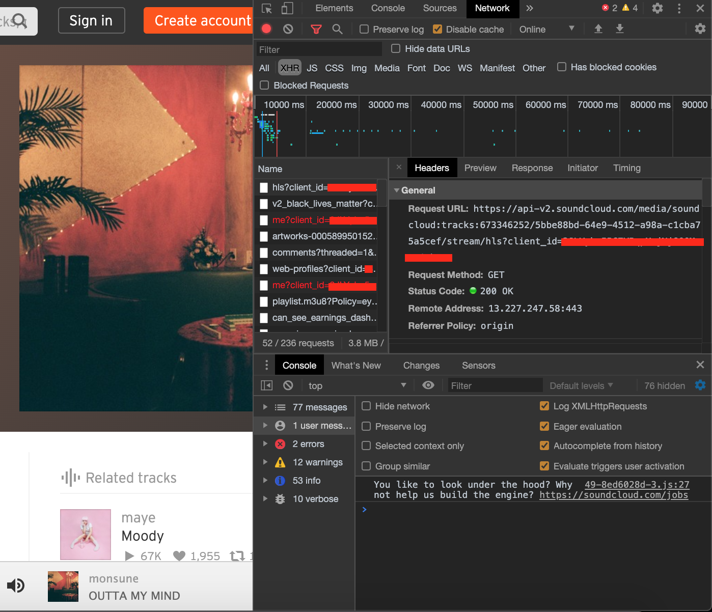

[](https://github.com/zackradisic)
[](https://www.npmjs.com/package/soundcloud-downloader)


Download Soundcloud tracks with Node.js
```
npm install soundcloud-downloader
```

I couldn't find any packages that worked with a Discord bot I was working on so I created my own.

#### Features
- Extremely fast (interacts directly with the Soundcloud API)
- Download/manipulate audio from Soundcloud (it is returned as a [stream](https://nodejs.org/api/stream.html))
- Get information about [tracks](https://zackradisic.github.io/node-soundcloud-downloader/classes/_index_.scdl.html#getinfo) and [playlists](https://zackradisic.github.io/node-soundcloud-downloader/classes/_index_.scdl.html#getsetinfo)
- [Filter](https://zackradisic.github.io/node-soundcloud-downloader/classes/_index_.scdl.html#filtermedia) and [download](https://zackradisic.github.io/node-soundcloud-downloader/classes/_index_.scdl.html#downloadformat) specific formats
- [Search](https://zackradisic.github.io/node-soundcloud-downloader/classes/_index_.scdl.html#search) and find [related](https://zackradisic.github.io/node-soundcloud-downloader/classes/_index_.scdl.html#related) tracks/playlists/albums/users

#### Table of Contents
- [API](#api)
- [Examples](#examples)
- [Obtaining a Client ID](#client-id)
- [To do](#to-do)

## API / [Documentation](https://zackradisic.github.io/node-soundcloud-downloader/classes/_index_.scdl.html)
Here are the two most commonly used functions:
### [scdl.download(url, clientID?)](https://zackradisic.github.io/node-soundcloud-downloader/classes/_index_.scdl.html#download)
- Gets the audio from the given URL, returns a [ReadableStream](https://nodejs.org/api/stream.html#stream_class_stream_readable).

### [scdl.getInfo(url, clientID?)](https://zackradisic.github.io/node-soundcloud-downloader/classes/_index_.scdl.html#getinfo)
- Returns a JSON object containing the track's information, as well as media links.

Read the [docs](https://zackradisic.github.io/node-soundcloud-downloader/classes/_index_.scdl.html) for more.

## Examples
The easiest way to get Soundcloud audio is with the `scdl.download(url: string)` function, which returns a Promise containing a ReadableStream.
```javascript
const scdl = require('soundcloud-downloader').default
const fs = require('fs')

const SOUNDCLOUD_URL = 'https://soundcloud.com/askdjfhaklshf'
const CLIENT_ID = 'asdhkalshdkhsf'

scdl.download(SOUNDCLOUD_URL).then(stream => stream.pipe(fs.createWriteStream('audio.mp3')))
```

You can do anything you like with the stream that is returned, an example with [Discord.js](https://github.com/discordjs/discord.js/):
```javascript
const client = new Discord.Client()
const url = 'https://soundcloud.com/taliya-jenkins/double-cheese-burger-hold-the'
const clientID = 'asdlkajasd'
const channelID = '123456789'
client.on('ready', () => {
  const channel = client.channels.cache.get(channelID)
  channel.join().then(connection => {
    scdl.download(url, clientID).then(stream => {
      connection.play(stream)
    })
  })
})
```

You can also create a custom instance of the SCDL class with settings configured to your liking:
```javascript
const scdlCreate = require('../').create
const axios = require('axios').default

const scdl = scdlCreate({
  clientID: 'adasdasd',
  saveClientID: true,
  filePath: './client_id.json',
  axiosInstance: axios.create()
})
```

You can view the code for these examples and find more in the [example](example) folder.


## Client ID
You can obtain a Client ID by visting the Soundcloud website and inspecting network traffic (perhaps with Chrome DevTools or some HTTP proxy software) and looking for any requests to the Soundcloud API. Ex:
```
https://api-v2.soundcloud.com/me/play-history/tracks?client_id={CLIENT ID IS HERE}&limit=25&offset=0&linked_partitioning=1&app_version=1590494738&app_locale=en
```

Here is a picture of where you should be able to find it:


## To-do
If I have the time and there is enough demand, I am interested in implementing the following functionalities:
- Audio format selection ✅
- Ability to use HTTP Live Streaming (HLS) ✅
- Some more integrations with Discord.js like selecting best format for voice channels

If you have any feature requests, suggestions or questions do not hesistate to post them in the issues section

## Disclaimer
I do not support piracy and this package is not designed for circumventing the technological measures employed
by SoundCloud preventing unauthorized access to copyrighted works. This package is only for downloading
audio you have access to.
